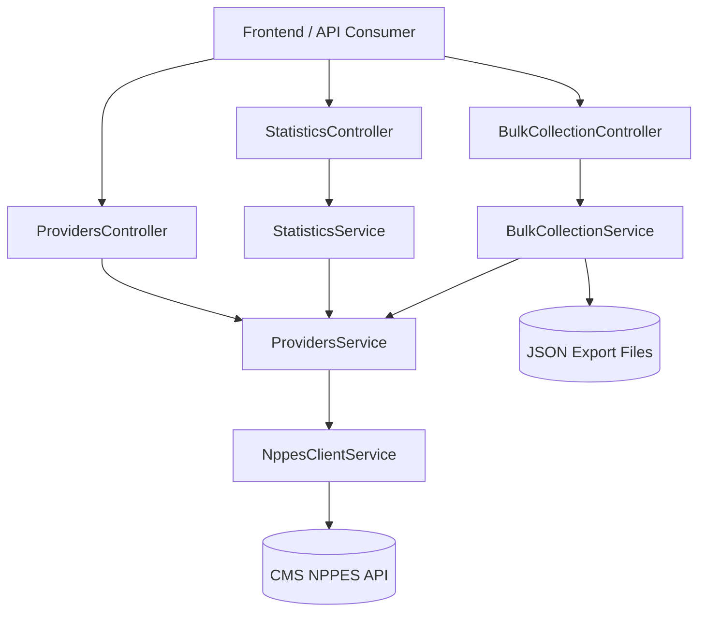

# API Documentation

## Overview

The Healthcare Provider Discovery Service exposes a NestJS API for searching the public NPPES registry, mapping raw CMS payloads into a stable provider contract, generating summary statistics, and starting asynchronous bulk collection jobs.



### Tech Stack Summary

- Runtime: Bun + Node.js 18+
- Framework: NestJS 11
- Language: TypeScript 5 with strict mode
- HTTP Client: Axios via `@nestjs/axios` with `axios-retry`
- Validation: `class-validator` + `class-transformer`
- API Docs: Swagger via `@nestjs/swagger`
- Testing: Jest + Supertest
- Shared Contracts: `@npi/contracts`

## Setup Instructions

### Prerequisites

- Bun 1.0+
- Node.js 18+

### Environment Variables

| Variable | Required | Default | Description |
|----------|----------|---------|-------------|
| `PORT` | No | `3000` | API port |
| `PROVIDERS_OUTPUT_DIR` | No | `apps/api/output` at runtime cwd | Output directory for bulk JSON exports |

### Install Dependencies

```bash
bun install
```

### Run the Backend

```bash
bun --cwd packages/contracts build
bun --cwd apps/api dev
```

### Run the Frontend

```bash
bun --cwd apps/frontend dev
```

### Docker

The repository requirements call for running the stack through `docker-compose up --build` from the `docker/` directory once Docker assets are in place.

## API Reference

### POST /api/providers/search

Search for healthcare providers by ZIP code or city/state, optionally filtered by taxonomy or provider type.

**Request Body**

| Field | Type | Required | Description |
|-------|------|----------|-------------|
| `zipCode` | string | No | 5-digit ZIP code |
| `city` | string | No | City name |
| `state` | string | No | 2-letter uppercase state code |
| `taxonomyCode` | string | No | 10-character taxonomy code |
| `taxonomyDescription` | string | No | Taxonomy description |
| `providerType` | number | No | `1` = Individual, `2` = Organization |
| `page` | number | No | 1-based page number |
| `limit` | number | No | Page size, clamped to `1..200` |

**Example Request**

```json
{
  "zipCode": "75201",
  "taxonomyDescription": "Dentist",
  "providerType": 1,
  "page": 1,
  "limit": 50
}
```

**Response Shape**

```json
{
  "providers": [
    {
      "npi": "1234567893",
      "type": 1,
      "name": "Jane Doe, MD",
      "primarySpecialty": "General Practice Dentistry",
      "specialties": ["General Practice Dentistry", "Pediatric Dentistry"],
      "address": {
        "address1": "123 Main St",
        "address2": "Suite 100",
        "city": "Austin",
        "state": "TX",
        "zipCode": "78701"
      },
      "phone": "5125551000"
    }
  ],
  "metadata": {
    "totalCount": 1,
    "searchParams": {
      "zipCode": "75201",
      "taxonomyDescription": "Dentist",
      "providerType": 1
    },
    "timestamp": "2026-03-07T12:00:00.000Z",
    "duration": 12,
    "page": 1,
    "limit": 50
  }
}
```

### POST /api/statistics

Generate aggregate statistics for a provider search.

**Request Body**

Same as `POST /api/providers/search`.

**Response Shape**

```json
{
  "summary": {
    "totalProviders": 12,
    "individualCount": 10,
    "organizationCount": 2,
    "multipleTaxonomiesCount": 4,
    "uniqueCitiesCount": 3
  },
  "providerTypeDistribution": [
    { "name": "Individual", "value": 10 },
    { "name": "Organization", "value": 2 }
  ],
  "topSpecialties": [
    { "description": "General Practice Dentistry", "count": 5, "percentage": 41.67 }
  ],
  "topCities": [
    { "name": "Austin", "count": 7 }
  ]
}
```

### POST /api/providers/bulk

Start an asynchronous bulk collection job and persist the search results to a JSON file.

**Request Body**

All fields from `SearchProvidersDto`, plus:

| Field | Type | Required | Description |
|-------|------|----------|-------------|
| `batchSize` | number | No | Upstream batch size, clamped to `50..200` |

**Response Shape**

```json
{
  "jobId": "job-123",
  "status": "PROCESSING",
  "message": "Bulk collection initiated. Results will be saved to the configured output directory."
}
```

### GET /api/health

Simple health-check endpoint.

**Response Shape**

```json
{
  "status": "ok"
}
```

## Data Models

### Provider

| Field | Type | Description |
|-------|------|-------------|
| `npi` | string | 10-digit NPI identifier |
| `type` | `1 | 2` | Individual or Organization |
| `name` | string | Computed provider display name |
| `primarySpecialty` | string | Primary taxonomy description |
| `specialties` | string[] | All taxonomy descriptions |
| `address` | object | Primary practice location from NPPES `addresses[0]` |
| `phone` | string \| null | Primary practice telephone number |

### Statistics

| Field | Type | Description |
|-------|------|-------------|
| `summary.totalProviders` | number | Total providers returned |
| `summary.individualCount` | number | Count of type 1 providers |
| `summary.organizationCount` | number | Count of type 2 providers |
| `summary.multipleTaxonomiesCount` | number | Providers with more than one specialty |
| `summary.uniqueCitiesCount` | number | Distinct non-empty city count |

### Error Response

```json
{
  "code": "VALIDATION_ERROR",
  "message": "Validation failed",
  "details": ["zipCode must be a 5-digit string"],
  "timestamp": "2026-03-07T12:00:00.000Z"
}
```

## Error Codes

| Code | HTTP Status | Description |
|------|-------------|-------------|
| `VALIDATION_ERROR` | 400 | Invalid request parameters |
| `PROVIDER_NOT_FOUND` | 404 | Provider or result set not found |
| `NPPES_UNAVAILABLE` | 502 | Upstream NPPES API unavailable |
| `RATE_LIMITED` | 429 | Upstream rate limiting encountered |

## NPPES Deep Pagination Mitigation

The current implementation applies two protections against known NPPES search constraints:

1. The synchronous search endpoint rejects pure state-only requests unless taxonomy criteria are provided, because the upstream API does not support state as the only input.
2. Upstream pagination is clamped to the documented NPPES bounds of `limit <= 200` and `skip <= 1000`, preventing invalid deep-pagination requests.

The bulk collection flow currently paginates within those upstream bounds and writes the collected dataset to disk. Query subdivision for state-wide bulk collection beyond the `skip = 1000` ceiling is still a follow-up enhancement.
