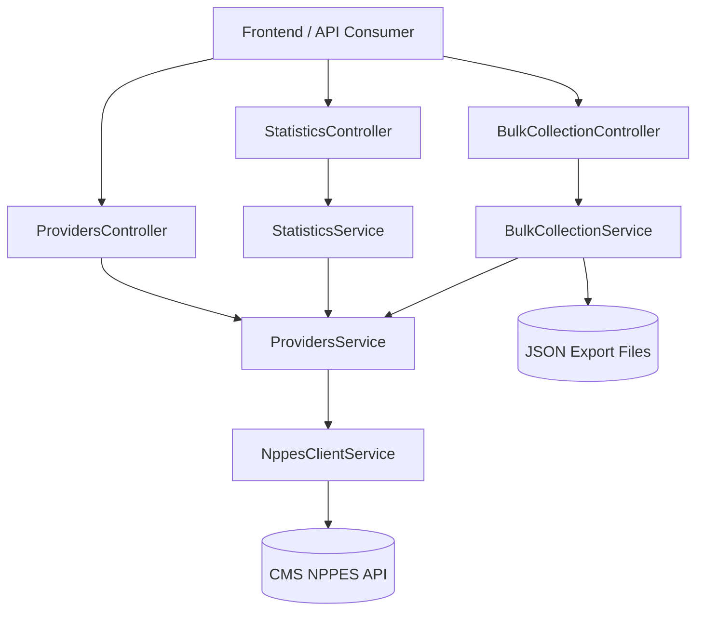

# API Documentation

## Overview

The Healthcare Provider Discovery Service exposes a NestJS API for searching the public NPPES registry, mapping raw CMS payloads into a stable provider contract, generating summary statistics, and starting asynchronous bulk collection jobs.

The backend now includes a partition-aware collector for broad searches. When a query risks exceeding the NPPES `skip <= 1000` ceiling, the service splits the request by provider type and then recursively refines it with `postal_code` wildcard partitions so state-only and other wide searches can continue safely instead of truncating silently.



### Tech Stack Summary

- Runtime: Bun + Node.js 18+
- Framework: NestJS 11
- Language: TypeScript 5 with strict mode
- HTTP Client: Axios via `@nestjs/axios` with `axios-retry`
- Validation: `class-validator` + `class-transformer`
- API Docs: Swagger via `@nestjs/swagger`
- Testing: Jest + Supertest
- Shared Contracts: `@npi/contracts`

## Setup Instructions

### Prerequisites

- Bun 1.0+
- Node.js 18+

### Environment Variables

| Variable | Required | Default | Description |
|----------|----------|---------|-------------|
| `PORT` | No | `3000` | API port |
| `API_URL` | No | `http://localhost:3000` | Internal API origin used by the frontend server rewrite |
| `NEXT_PUBLIC_API_URL` | No | `http://localhost:3000` | Public browser-facing API origin |
| `PROVIDERS_OUTPUT_DIR` | No | `apps/api/output` at runtime cwd | Output directory for bulk JSON exports |
| `REDIS_URL` | No | `redis://redis:6379` | Redis endpoint used for broad-search cache and bulk-progress pub/sub, with in-memory fallback when unavailable |

### Install Dependencies

```bash
bun install
```

### Run the Backend

```bash
bun --cwd packages/contracts build
bun --cwd apps/api dev
```

### Run the Frontend

```bash
bun --cwd apps/frontend dev
```

### Docker

The repository includes a Docker Compose stack under `docker/`.

```bash
cd docker
docker compose up --build
```

The compose stack starts:

- API on `http://localhost:3000`
- Swagger on `http://localhost:3000/api/docs`
- Frontend on `http://localhost:3001`
- Redis on `localhost:6379`

The backend and frontend images use multi-stage builds. The frontend runs with Next.js standalone output so the production container only includes the compiled server bundle and required runtime assets.

## CI/CD

GitHub Actions workflows are defined in `.github/workflows/`:

- `ci.yml`: runs lint, typecheck, test coverage, and build on pushes and pull requests to `main`
- `deploy.yml`: triggers production deployment after a successful `CI` workflow run on `main`

Production deployment targets:

- Render for the NestJS API
- Vercel for the Next.js frontend

Required GitHub repository secrets:

- `RENDER_API_KEY`
- `RENDER_API_SERVICE_ID`
- `VERCEL_API_TOKEN`
- `VERCEL_ORG_ID`
- `VERCEL_PROJECT_ID`

For manual infrastructure provisioning through the `Deploy` workflow with `apply_infra=true`, also provide `RENDER_OWNER_ID`.

## API Reference

### POST /api/providers/search

Search for healthcare providers by exact NPI, ZIP code, city/state, or state-only, optionally filtered by taxonomy or provider type.

**Request Body**

| Field | Type | Required | Description |
|-------|------|----------|-------------|
| `npi` | string | No | Exact 10-digit NPI lookup |
| `zipCode` | string | No | 5-digit ZIP code |
| `city` | string | No | City name |
| `state` | string | No | 2-letter uppercase state code |
| `taxonomyCode` | string | No | 10-character taxonomy code |
| `taxonomyDescription` | string | No | Taxonomy description |
| `providerType` | number | No | `1` = Individual, `2` = Organization |
| `page` | number | No | 1-based page number |
| `limit` | number | No | Page size, clamped to `1..200` |

**Example Request**

```json
{
  "npi": "1234567893",
  "zipCode": "75201",
  "taxonomyDescription": "Dentist",
  "providerType": 1,
  "page": 1,
  "limit": 50
}
```

**Response Shape**

```json
{
  "providers": [
    {
      "npi": "1234567893",
      "type": 1,
      "name": "Jane Doe, MD",
      "primarySpecialty": "General Practice Dentistry",
      "specialties": ["General Practice Dentistry", "Pediatric Dentistry"],
      "address": {
        "address1": "123 Main St",
        "address2": "Suite 100",
        "city": "Austin",
        "state": "TX",
        "zipCode": "78701"
      },
      "phone": "5125551000"
    }
  ],
  "metadata": {
    "totalCount": 1,
    "searchParams": {
      "npi": "1234567893",
      "zipCode": "75201",
      "taxonomyDescription": "Dentist",
      "providerType": 1
    },
    "timestamp": "2026-03-07T12:00:00.000Z",
    "duration": 12,
    "page": 1,
    "limit": 50,
    "upstreamLimitUsed": 50,
    "partitioned": false,
    "partitionCount": 1,
    "complete": true,
    "overflowedPartitionCount": 0,
    "estimatedRemainingProviders": 0
  }
}
```

**Partition-aware metadata**

- `upstreamLimitUsed`: The actual NPPES page size used for collection.
- `partitioned`: Whether the backend had to split the query into smaller upstream searches.
- `partitionCount`: Number of partition leaf queries executed.
- `complete`: Whether every matching partition was fully collected.
- `overflowedPartitionCount`: Number of leaf partitions that still exceeded the upstream cap.
- `estimatedRemainingProviders`: Best-effort count of providers that could not be retrieved because a leaf partition remained larger than the NPPES maximum retrievable window.

### POST /api/statistics

Generate aggregate statistics for a provider search.

**Request Body**

Same as `POST /api/providers/search`.

**Response Shape**

```json
{
  "summary": {
    "totalProviders": 12,
    "individualCount": 10,
    "organizationCount": 2,
    "multipleTaxonomiesCount": 4,
    "uniqueCitiesCount": 3
  },
  "providerTypeDistribution": [
    { "name": "Individual", "value": 10 },
    { "name": "Organization", "value": 2 }
  ],
  "topSpecialties": [
    { "description": "General Practice Dentistry", "count": 5, "percentage": 41.67 }
  ],
  "topCities": [
    { "name": "Austin", "count": 7 }
  ],
  "taxonomyBreakdown": [
    {
      "code": "1223G0001X",
      "description": "General Practice Dentistry",
      "count": 5,
      "percentage": 41.67
    }
  ]
}
```

### POST /api/providers/bulk

Start an asynchronous bulk collection job and persist the search results to a JSON file.

**Request Body**

All fields from `SearchProvidersDto`, plus:

| Field | Type | Required | Description |
|-------|------|----------|-------------|
| `batchSize` | number | No | Upstream batch size, clamped to `50..200` |

**Response Shape**

```json
{
  "jobId": "job-123",
  "status": "PROCESSING",
  "message": "Bulk collection initiated. Results will be saved to the configured output directory."
}
```

### GET /api/health

Simple health-check endpoint.

**Response Shape**

```json
{
  "status": "ok"
}
```

## Data Models

### Provider

| Field | Type | Description |
|-------|------|-------------|
| `npi` | string | 10-digit NPI identifier |
| `type` | `1 | 2` | Individual or Organization |
| `name` | string | Computed provider display name |
| `primarySpecialty` | string | Primary taxonomy description |
| `specialties` | string[] | All taxonomy descriptions |
| `address` | object | Primary practice location from NPPES `addresses[0]` |
| `phone` | string \| null | Primary practice telephone number |

### Statistics

| Field | Type | Description |
|-------|------|-------------|
| `summary.totalProviders` | number | Total providers returned |
| `summary.individualCount` | number | Count of type 1 providers |
| `summary.organizationCount` | number | Count of type 2 providers |
| `summary.multipleTaxonomiesCount` | number | Providers with more than one specialty |
| `summary.uniqueCitiesCount` | number | Distinct non-empty city count |
| `taxonomyBreakdown` | array | Sortable per-taxonomy distribution including code, description, count, and percentage |

### Error Response

```json
{
  "code": "VALIDATION_ERROR",
  "message": "Validation failed",
  "details": ["zipCode must be a 5-digit string"],
  "timestamp": "2026-03-07T12:00:00.000Z"
}
```

## Error Codes

| Code | HTTP Status | Description |
|------|-------------|-------------|
| `VALIDATION_ERROR` | 400 | Invalid request parameters |
| `PROVIDER_NOT_FOUND` | 404 | Provider or result set not found |
| `NPPES_UNAVAILABLE` | 502 | Upstream NPPES API unavailable |
| `RATE_LIMITED` | 429 | Upstream rate limiting encountered |

## NPPES Deep Pagination Mitigation

The current implementation applies three protections against known NPPES search constraints:

1. Upstream pagination is clamped to the documented NPPES bounds of `limit <= 200` and `skip <= 1000`.
2. When `providerType` is omitted, the collector splits the request into `NPI-1` and `NPI-2` branches before collecting results.
3. For state-only searches, and for any branch whose `result_count` exceeds the maximum retrievable NPPES window, the collector recursively partitions the query with `postal_code` wildcard prefixes. Pure state-only searches are seeded with postal partitions immediately so the backend never sends an upstream request that violates the NPPES rule that `state` cannot be the only criterion besides enumeration type.

If a leaf branch is still larger than the NPPES retrieval ceiling after the deepest supported postal refinement, the API returns partial results and surfaces that condition through `complete`, `overflowedPartitionCount`, and `estimatedRemainingProviders` instead of silently truncating the dataset.

## Frontend Map

The search UI now includes a Leaflet-based provider footprint map. Providers are plotted from ZIP-code centroids using a local ZIP dataset, which avoids per-request geocoding dependencies while still giving users a usable geographic distribution view for the current result set.
