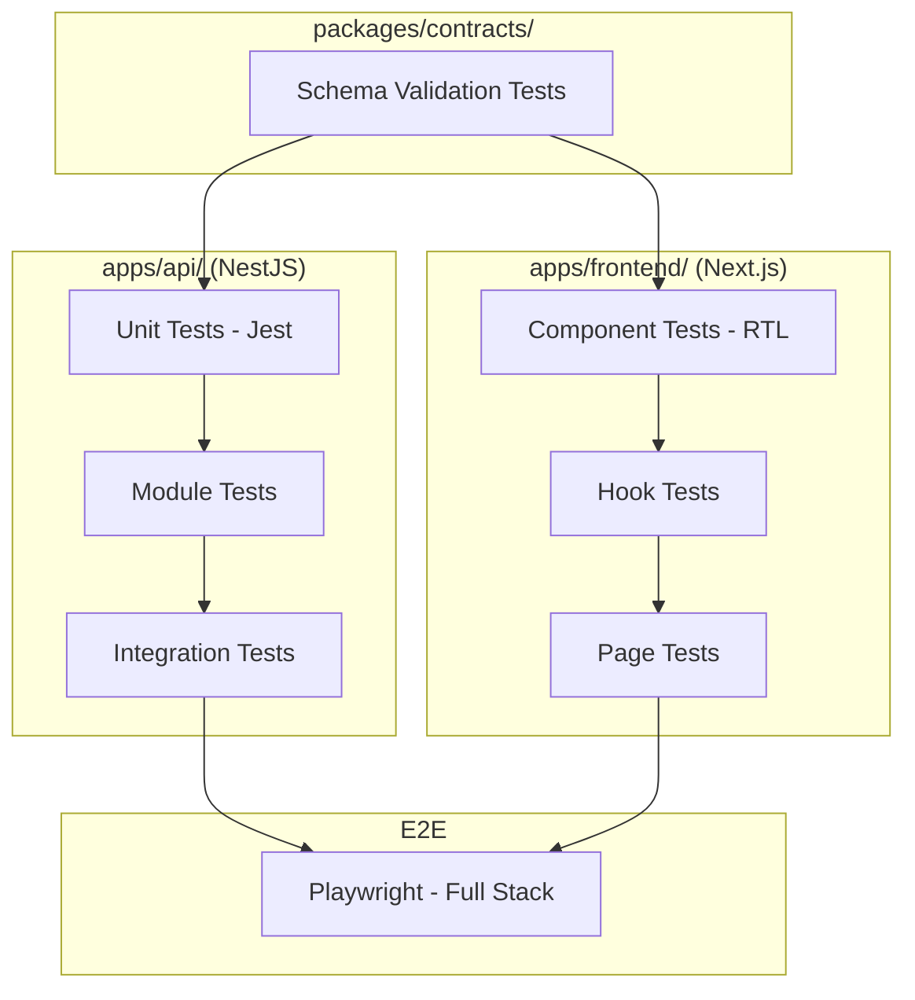

# Test Harness Strategy

> Detailed testing strategy for the NPI Discovery Service monorepo.
> Coverage targets: **≥85% Backend** | **≥70% Frontend** | 100% test pass rate.

---

## 1. Testing Architecture Overview



### Test Runner & Tooling

| Layer | Runner | Mocking | Coverage |
|-------|--------|---------|----------|
| `apps/api/` | Jest (NestJS preset) | `@nestjs/testing`, manual mocks | `jest --coverage` |
| `apps/frontend/` | Jest (next/jest) | MSW (Mock Service Worker) | `jest --coverage` |
| `packages/contracts/` | Jest | None (pure type/schema validation) | `jest --coverage` |
| E2E | Playwright | MSW (network layer) or Playwright route mocking | Playwright built-in |

### Running Tests

```bash
# Run all tests across the monorepo via Turborepo
bun run test

# Run tests with coverage for all workspaces
bun run test:cov

# Run tests for a specific workspace
bun run --filter @npi/api test
bun run --filter @npi/web test
bun run --filter @npi/contracts test

# Run E2E tests
bun run test:e2e
```

---

## 2. Backend Test Strategy (`apps/api/`)

### 2.1 Test File Organization

```
apps/api/
├── src/
│   └── modules/
│       ├── nppes-client/
│       │   ├── nppes-client.service.ts
│       │   └── nppes-client.service.spec.ts
│       ├── providers/
│       │   ├── providers.controller.ts
│       │   ├── providers.controller.spec.ts
│       │   ├── providers.service.ts
│       │   └── providers.service.spec.ts
│       ├── bulk-collection/
│       │   ├── bulk-collection.service.ts
│       │   └── bulk-collection.service.spec.ts
│       └── statistics/
│           ├── statistics.service.ts
│           └── statistics.service.spec.ts
├── test/
│   ├── fixtures/                 # Shared mock data
│   │   ├── nppes-response.fixture.ts
│   │   ├── provider.fixture.ts
│   │   └── search-params.fixture.ts
│   ├── helpers/
│   │   └── test-module.helper.ts # Reusable NestJS TestingModule factory
│   └── app.e2e-spec.ts          # HTTP-level integration tests
└── jest.config.ts
```

### 2.2 Mocking Strategy

**Golden Rule:** Zero real network calls. All NPPES HTTP interactions are mocked.

```typescript
// Mock the HttpService (Axios wrapper) at the module level
const mockHttpService = {
  get: jest.fn(),
  axiosRef: { defaults: { baseURL: '' } },
}

// Build the test module with DI overrides
const module = await Test.createTestingModule({
  providers: [
    NppesClientService,
    { provide: HttpService, useValue: mockHttpService },
  ],
}).compile()
```

**What to mock:**
| Dependency | Mock Approach |
|------------|--------------|
| `HttpService` (Axios) | Jest mock returning fixture data |
| `CacheManager` (Redis) | In-memory `Map`-based stub |
| `WebSocketGateway` | Jest spy on `emit()` |
| `FileSystem` (fs) | `memfs` or Jest manual mock |
| `ConfigService` | Static object with test values |

**What NOT to mock:**
- `class-validator` decorators — let them run to verify DTO validation
- `class-transformer` — let serialization run
- Internal service logic — test real business logic paths

### 2.3 Test Cases by Module

#### NPPES Client Tests (`modules/nppes-client/`)

| Test Case | Description | Key Assertion |
|-----------|-------------|---------------|
| should build correct query params for ZIP search | Verify URL construction | `expect(url).toContain('postal_code=75201')` |
| should build correct query params for city/state | Verify multi-param URL | URL includes `city`, `state`, `version=2.1` |
| should map `providerType: 1` to `enumeration_type=NPI-1` | Verify enum translation | Upstream gets `NPI-1`, not `1` |
| should parse NPPES response into ProviderDto[] | Verify response mapping | Clean DTO shape, `null` fallbacks |
| should handle missing `basic` fields gracefully | Verify null safety | No crash, returns `name: 'Unknown'` fallback |
| should handle missing `addresses` array | Verify null safety | Returns address with null fields |
| should handle network errors (ECONNREFUSED) | Verify error wrapping | Throws `NppesUnavailableException` (maps to 502) |
| should handle 429 with exponential backoff | Verify retry logic | `axios-retry` triggers, delays increase |
| should retry up to N times then fail | Verify retry exhaustion | After max retries, throws with partial context |
| should respect `limit` and `skip` bounds | Verify param clamping | `limit ≤ 200`, `skip ≤ 1000` |

#### Providers Controller Tests (`modules/providers/`)

| Test Case | Description | Key Assertion |
|-----------|-------------|---------------|
| should return providers for valid ZIP code | Happy path ZIP | 200 with `providers[]` and `metadata` |
| should return providers for city/state | Happy path city/state | 200 with filtered results |
| should filter by providerType | Taxonomy filtering | Only type 1 or 2 in response |
| should return 400 for invalid ZIP (non-5-digit) | Validation error | 400 with `class-validator` message |
| should return 400 for invalid state (non-2-letter) | Validation error | 400 with clear message |
| should return empty array when no results | Empty result | 200 with `providers: []`, `totalCount: 0` |
| should generate statistics via POST /api/statistics | Stats endpoint | Response has all summary fields |
| should return taxonomy list | Taxonomy endpoint | Array of taxonomy descriptions |
| should return 502 when NPPES is down | Upstream failure | 502 with `NPPES_UNAVAILABLE` code |

#### Providers Service Tests (`modules/providers/`)

| Test Case | Description | Key Assertion |
|-----------|-------------|---------------|
| should handle NPPES pagination (skip increments) | Verify pagination loop | Multiple HTTP calls with increasing `skip` |
| should stop pagination at skip=1000 | Verify hard limit | No request with `skip > 1000` |
| should handle rate limiting (429 backoff) | Verify retry integration | Service retries, returns data after backoff |
| should filter by primary taxonomy only | Verify taxonomy filter | Only providers with matching `primary: true` taxonomy |
| should calculate type breakdown (individual vs org) | Verify stats logic | Correct counts for type 1 and 2 |
| should calculate taxonomy distribution | Verify specialty breakdown | Sorted desc by count, percentages sum ≤ 100 |
| should count providers with multiple taxonomies | Verify multi-tax count | Correct count where `taxonomies.length > 1` |
| should compute top 10 specialties | Verify top-N logic | Array length ≤ 10, sorted by count desc |
| should compute top 10 cities | Verify geographic breakdown | Array length ≤ 10 from address data |

#### Bulk Collection Tests (`modules/bulk-collection/`)

| Test Case | Description | Key Assertion |
|-----------|-------------|---------------|
| should return 202 Accepted with jobId | Verify async kickoff | Status 202, response has `jobId` |
| should partition query when total > 1000 | Verify partitioning algo | Multiple provider-type and postal sub-queries issued |
| should emit WebSocket progress events | Verify pub/sub | `gateway.emit()` called with `{ total, collected, remaining }` |
| should save results to correctly named JSON file | Verify file I/O | File matches `providers_{location}_{taxonomy}_{timestamp}.json` |
| should include collection metadata in output | Verify metadata | File contains searchParams, totalCount, duration |
| should preserve partial results on failure | Verify fault tolerance | Already-collected data is saved before throwing |

The current backend implementation covers the partitioning algorithm primarily through `provider-search-collector.service.spec.ts`, where the collector is tested directly for:

- provider-type fan-out when `providerType` is omitted
- recursive `postal_code` wildcard partitioning for state-only and oversized branches
- deduplication across partitions
- explicit overflow metadata when an exact ZIP still exceeds the upstream cap

#### Statistics Service Tests (`modules/statistics/`)

| Test Case | Description |
|-----------|-------------|
| should return correct summary counts | `totalProviders`, `individualCount`, `organizationCount` |
| should calculate `multipleTaxonomiesCount` | Providers with >1 taxonomy |
| should calculate `uniqueCitiesCount` | Distinct cities from addresses |
| should return `providerTypeDistribution` for Recharts | `[{ name: 'Individual', value: N }, ...]` |
| should return `topSpecialties` with percentages | Sorted, percentages are correct |
| should return `topCities` sorted by count | Top 10 cities desc |

### 2.4 Integration Tests (`test/app.e2e-spec.ts`)

Full HTTP-level tests using `supertest` against a compiled NestJS app with mocked external dependencies:

```typescript
describe('ProvidersController (e2e)', () => {
  let app: INestApplication

  beforeAll(async () => {
    const moduleFixture = await Test.createTestingModule({
      imports: [AppModule],
    })
      .overrideProvider(HttpService)
      .useValue(mockHttpService)
      .overrideProvider(CACHE_MANAGER)
      .useValue(mockCacheManager)
      .compile()

    app = moduleFixture.createNestApplication()
    app.useGlobalPipes(new ValidationPipe({ whitelist: true, transform: true }))
    await app.init()
  })

  it('POST /api/providers/search → 200 with valid ZIP', () => {
    return request(app.getHttpServer())
      .post('/api/providers/search')
      .send({ zipCode: '75201' })
      .expect(200)
      .expect((res) => {
        expect(res.body.providers).toBeDefined()
        expect(res.body.metadata.totalCount).toBeGreaterThanOrEqual(0)
      })
  })

  it('POST /api/providers/search → 400 with invalid ZIP', () => {
    return request(app.getHttpServer())
      .post('/api/providers/search')
      .send({ zipCode: 'ABCDE' })
      .expect(400)
  })
})
```

---

## 3. Frontend Test Strategy (`apps/frontend/`)

### 3.1 Test File Organization

```
apps/frontend/
├── src/
│   ├── components/
│   │   ├── providers/
│   │   │   ├── search-form.tsx
│   │   │   ├── search-form.test.tsx
│   │   │   ├── results-table.tsx
│   │   │   ├── results-table.test.tsx
│   │   │   ├── provider-card.tsx
│   │   │   └── provider-card.test.tsx
│   │   ├── statistics/
│   │   │   ├── stats-dashboard.tsx
│   │   │   └── stats-dashboard.test.tsx
│   │   └── ui/
│   │       └── (shadcn primitives — minimal testing, trust Radix)
│   ├── lib/
│   │   ├── hooks/
│   │   │   ├── use-provider-search.ts
│   │   │   └── use-provider-search.test.ts
│   │   └── stores/
│   │       ├── search-store.ts
│   │       └── search-store.test.ts
│   └── app/
│       └── (page-level tests co-located or in __tests__/)
├── __mocks__/                   # MSW handlers
│   ├── handlers.ts
│   └── server.ts
└── jest.config.ts
```

### 3.2 MSW Setup (Mock Service Worker)

All frontend tests mock the API boundary using MSW. No direct function mocking of `fetch` or Axios.

```typescript
// __mocks__/handlers.ts
import { http, HttpResponse } from 'msw'
import type { SearchResponseDto, StatisticsResponseDto } from '@npi/contracts'

export const handlers = [
  http.post('/api/providers/search', async ({ request }) => {
    const body = await request.json()
    if (body.zipCode === '00000') {
      return HttpResponse.json({ providers: [], metadata: { totalCount: 0 } })
    }
    return HttpResponse.json(mockSearchResponse)
  }),

  http.post('/api/statistics', () => {
    return HttpResponse.json(mockStatisticsResponse)
  }),
]

// __mocks__/server.ts
import { setupServer } from 'msw/node'
import { handlers } from './handlers'

export const server = setupServer(...handlers)
```

```typescript
// jest.setup.ts (referenced in jest.config.ts setupFilesAfterSetup)
import { server } from './__mocks__/server'

beforeAll(() => server.listen({ onUnhandledRequest: 'error' }))
afterEach(() => server.resetHandlers())
afterAll(() => server.close())
```

### 3.3 Test Cases by Layer

#### Component Tests

**SearchForm (`components/providers/search-form.test.tsx`):**

| Test Case | Description |
|-----------|-------------|
| renders all input fields (ZIP, city, state, taxonomy) | Verify form elements present |
| toggles between ZIP / City+State / State-only modes | Verify mode switching |
| validates ZIP format (rejects non-5-digit) | React Hook Form validation |
| validates state format (rejects non-2-letter) | React Hook Form validation |
| submits with valid data | `onSubmit` called with correct DTO shape |
| shows loading state during submission | Button disabled, spinner visible |
| clears form on reset | All fields empty after reset |
| shows common specialty quick-select buttons | Buttons render and populate taxonomy |

**ResultsTable (`components/providers/results-table.test.tsx`):**

| Test Case | Description |
|-----------|-------------|
| renders provider rows with mock data | Table has correct row count |
| displays NPI, name, specialty, city, state columns | All columns present |
| sorts by column (ascending/descending) | Click header → sorted data |
| paginates correctly (10/25/50 per page) | Page controls change visible rows |
| shows Individual vs Organization badge | Type badge renders correctly |
| expands row to show full details | Click row → expanded panel |
| toggles between table and card view | View switcher works |

**ProviderCard (`components/providers/provider-card.test.tsx`):**

| Test Case | Description |
|-----------|-------------|
| renders name, NPI, specialty, address, phone | All fields visible |
| distinguishes Individual vs Organization | Badge/icon renders |

**StatsDashboard (`components/statistics/stats-dashboard.test.tsx`):**

| Test Case | Description |
|-----------|-------------|
| displays summary cards (total, individual, org) | Cards render with correct values |
| renders provider type pie/donut chart | Recharts component mounts |
| renders top specialties bar chart | Bar chart with correct data |
| renders top cities bar chart | Bar chart with correct data |
| taxonomy table is sortable by count | Click header → sorted |

**State & Loading Tests:**

| Test Case | Description |
|-----------|-------------|
| loading state displays skeleton/spinner | Skeleton loaders visible during fetch |
| error state displays user-friendly message | Error banner with retry button |
| empty state displays helpful message | "No providers found" with suggestions |

#### Hook Tests (`lib/hooks/`)

**`useProviderSearch` (`use-provider-search.test.ts`):**

Tested using `@testing-library/react-hooks` (or `renderHook` from RTL) with TanStack Query wrapper:

```typescript
const wrapper = ({ children }) => (
  <QueryClientProvider client={new QueryClient({
    defaultOptions: { queries: { retry: false } },
  })}>
    {children}
  </QueryClientProvider>
)
```

| Test Case | Description |
|-----------|-------------|
| returns `isLoading: true` initially | Loading state before resolve |
| returns data on successful fetch | `data.providers` populated |
| returns error on failed fetch | `error` is set, `data` is undefined |
| refetches on param change | New request when search params change |
| caches results for same params | No duplicate request for cached query |

#### Zustand Store Tests (`lib/stores/`)

**`search-store.test.ts`:**

| Test Case | Description |
|-----------|-------------|
| initializes with default search mode (ZIP) | Default state correct |
| switches search mode (ZIP → City/State → State) | Mode toggle works |
| stores and retrieves search filters | Set/get round-trip |
| clears filters on reset | All filters back to defaults |
| persists recent searches (if localStorage bonus) | LocalStorage read/write |

#### Export Tests

| Test Case | Description |
|-----------|-------------|
| Download JSON triggers file download | Blob creation + anchor click |
| JSON file contains correct metadata | Parsed file matches expected shape |
| Download CSV produces valid CSV (bonus) | CSV headers and rows correct |

---

## 4. Shared Contracts Tests (`packages/contracts/`)

These tests validate that the DTOs and interfaces remain correct and that validation decorators work as expected in isolation.

```
packages/contracts/
├── src/
│   ├── dtos/
│   │   ├── search-providers.dto.ts
│   │   └── search-providers.dto.spec.ts
│   └── interfaces/
│       ├── provider.interface.ts
│       └── provider.interface.spec.ts
└── jest.config.ts
```

| Test Case | Description |
|-----------|-------------|
| SearchProvidersDto accepts valid ZIP | `validate()` returns no errors |
| SearchProvidersDto rejects invalid ZIP | `validate()` returns zipCode error |
| SearchProvidersDto rejects invalid state code | `validate()` returns state error |
| SearchProvidersDto accepts omitted optional fields | All optional fields can be undefined |
| BulkCollectionDto enforces batchSize bounds | `min: 50`, `max: 200` enforced |
| ProviderDto type guard works correctly | Runtime type narrowing |

---

## 5. E2E Test Strategy (Playwright)

### 5.1 Setup

```
tests/
├── e2e/
│   ├── search.spec.ts           # Primary search flow
│   ├── statistics.spec.ts       # Dashboard rendering
│   ├── export.spec.ts           # JSON/CSV download
│   └── fixtures/
│       └── mock-api.ts          # Playwright route interception
├── playwright.config.ts
└── global-setup.ts              # Start Next.js + NestJS (or mock server)
```

### 5.2 Playwright Configuration

```typescript
// playwright.config.ts
import { defineConfig } from '@playwright/test'

export default defineConfig({
  testDir: './tests/e2e',
  timeout: 30_000,
  retries: 1,
  use: {
    baseURL: 'http://localhost:3000',
    trace: 'on-first-retry',
  },
  webServer: {
    command: 'bun run dev',
    port: 3000,
    reuseExistingServer: !process.env.CI,
  },
})
```

### 5.3 E2E Test Cases

| Test Case | Flow |
|-----------|------|
| Search by ZIP → Results displayed | Enter ZIP → Submit → Table renders with rows |
| Search by City/State → Filtered results | Select city/state → Submit → Correct providers |
| Toggle table ↔ card view | Click toggle → View switches |
| Sort results by column | Click column header → Order changes |
| Paginate through results | Click next/prev → Different rows |
| View statistics dashboard | After search → Charts render |
| Download JSON export | Click button → File downloaded with correct name |
| Empty state for no results | Search obscure ZIP → Empty state message |
| Error state on API failure | Mock 502 → Error banner shown |
| Form validation prevents bad input | Enter invalid ZIP → Error shown, no submit |

### 5.4 API Mocking in Playwright

```typescript
// fixtures/mock-api.ts
import type { Page } from '@playwright/test'

export async function mockSearchApi(page: Page) {
  await page.route('**/api/providers/search', async (route) => {
    await route.fulfill({
      status: 200,
      contentType: 'application/json',
      body: JSON.stringify({
        providers: [/* fixture data */],
        metadata: { totalCount: 5, timestamp: new Date().toISOString(), duration: 120 },
      }),
    })
  })
}
```

---

## 6. Coverage Configuration

### Backend (`apps/api/jest.config.ts`)

```typescript
export default {
  moduleFileExtensions: ['js', 'json', 'ts'],
  rootDir: '.',
  testRegex: '.*\\.spec\\.ts$',
  transform: { '^.+\\.(t|j)s$': 'ts-jest' },
  collectCoverageFrom: [
    'src/**/*.ts',
    '!src/**/*.module.ts',
    '!src/**/*.dto.ts',      // DTOs tested in contracts package
    '!src/main.ts',
  ],
  coverageDirectory: './coverage',
  coverageThreshold: {
    global: {
      branches: 85,
      functions: 85,
      lines: 85,
      statements: 85,
    },
  },
  testEnvironment: 'node',
}
```

### Frontend (`apps/frontend/jest.config.ts`)

```typescript
import nextJest from 'next/jest'

const createJestConfig = nextJest({ dir: './' })

export default createJestConfig({
  testEnvironment: 'jsdom',
  setupFilesAfterSetup: ['<rootDir>/jest.setup.ts'],
  moduleNameMapper: {
    '^@/(.*)$': '<rootDir>/src/$1',
  },
  collectCoverageFrom: [
    'src/**/*.{ts,tsx}',
    '!src/**/*.d.ts',
    '!src/app/layout.tsx',
    '!src/components/ui/**',  // shadcn primitives — trust Radix
  ],
  coverageDirectory: './coverage',
  coverageThreshold: {
    global: {
      branches: 70,
      functions: 70,
      lines: 70,
      statements: 70,
    },
  },
})
```

### Turborepo Task (`turbo.json` snippet)

```json
{
  "tasks": {
    "test": {
      "dependsOn": ["^build"],
      "inputs": ["src/**", "test/**", "jest.config.*"],
      "cache": false
    },
    "test:cov": {
      "dependsOn": ["^build"],
      "inputs": ["src/**", "test/**", "jest.config.*"],
      "outputs": ["coverage/**"],
      "cache": false
    },
    "test:e2e": {
      "dependsOn": ["build"],
      "cache": false
    }
  }
}
```

---

## 7. CI Integration (GitHub Actions)

Tests run as part of the GitHub Actions pipeline. The suggested stage order:

```
1. bun install
2. turbo run contracts:check    # Validate shared schemas
3. turbo run typecheck           # tsc --noEmit across all workspaces
4. turbo run lint                # ESLint 9 flat config
5. turbo run test:cov            # Jest with coverage (all workspaces)
6. turbo run build               # Nest build + Next.js build
7. turbo run test:e2e            # Playwright (post-build)
```

Coverage reports should be uploaded as artifacts and optionally posted to PR comments.

### Branch Strategy

| Branch | Environment | Tests Required |
|--------|-------------|----------------|
| Feature branches | — | All unit + integration |
| `develop` | Staging | All unit + integration + E2E |
| `main` | Production | All unit + integration + E2E + manual approval |

---

## 8. Test Data Management

### Fixtures

All test fixtures live in dedicated `fixtures/` directories per workspace and use factory functions for flexibility:

```typescript
// test/fixtures/provider.fixture.ts
import type { ProviderDto } from '@npi/contracts'

export function createProvider(overrides: Partial<ProviderDto> = {}): ProviderDto {
  return {
    npi: '1234567890',
    type: 1,
    name: 'John Doe, MD',
    primarySpecialty: 'Internal Medicine',
    specialties: ['Internal Medicine'],
    address: {
      address1: '123 Main St',
      address2: null,
      city: 'Austin',
      state: 'TX',
      zipCode: '73301',
    },
    phone: '5125551234',
    ...overrides,
  }
}

export function createProviders(count: number): ProviderDto[] {
  return Array.from({ length: count }, (_, i) =>
    createProvider({ npi: String(1234567890 + i) }),
  )
}
```

### NPPES Raw Response Fixtures

```typescript
// test/fixtures/nppes-response.fixture.ts
export function createNppesResponse(count: number) {
  return {
    result_count: count,
    results: Array.from({ length: count }, (_, i) => ({
      number: String(1234567890 + i),
      enumeration_type: 'NPI-1' as const,
      basic: { first_name: 'John', last_name: 'Doe', credential: 'MD' },
      addresses: [
        { address_1: '123 Main St', city: 'Austin', state: 'TX', postal_code: '73301' },
        { address_1: '456 Mail St', city: 'Austin', state: 'TX', postal_code: '73301' },
      ],
      taxonomies: [{ code: '207Q00000X', desc: 'Family Medicine', primary: true, state: 'TX' }],
    })),
  }
}
```

---

## 9. Key Testing Principles

1. **No real network calls.** Backend mocks `HttpService`. Frontend uses MSW. E2E uses Playwright route interception.
2. **Types from `@npi/contracts`.** All fixtures and assertions use shared types — never inline `any` objects.
3. **Test behavior, not implementation.** Assert on outputs and side effects, not internal method calls.
4. **Each test is independent.** No shared mutable state between tests. Reset MSW handlers and Zustand stores in `afterEach`.
5. **Coverage ≠ quality.** Prioritize boundary tests (validation, error paths, edge cases) over trivial happy paths.
6. **Co-locate tests with source.** `*.spec.ts` / `*.test.tsx` next to the file being tested. Integration/E2E tests in dedicated `test/` or `tests/` directories.
